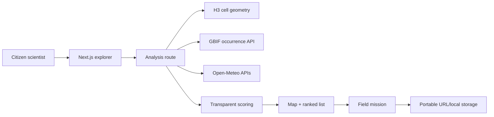

# WildGap

**Find where nature data is missing, then go look.**

WildGap is a biodiversity survey copilot for school eco-clubs and citizen scientists. It compares recent and historical observation coverage across H3 cells, adds weather and climate context, and turns a candidate monitoring gap into a safe, shareable 60-minute field mission.

Public repository: [github.com/Fink692/wildgap](https://github.com/Fink692/wildgap)

Live app: [wildgap-habitat-2026.fink692.chatgpt.site](https://wildgap-habitat-2026.fink692.chatgpt.site)

> WildGap ranks **observation coverage gaps**. It does not estimate habitat health, species abundance, population decline, or ecological causation.

## What works

- Global place search through Open-Meteo Geocoding
- Focused seven-cell H3 analysis for 2, 5, and 10 km areas
- Live GBIF occurrence counts for the latest 12 months versus the preceding 36 months
- Transparent survey-priority score and confidence level
- Previous-month climate context and seven-day survey windows from Open-Meteo
- Interactive MapLibre/OpenFreeMap map plus an equivalent keyboard-accessible ranked list
- Portable, printable mission links that work without an account
- Field cards with score provenance, weather, readiness checks, a timed protocol, and optional evidence completion
- Device-local mission history with complete, account-free share links
- Explicitly labeled Winnipeg demo snapshot for outage-safe judging

## Run locally

Requirements: Node.js 22+ and pnpm.

```bash
pnpm install
cp .env.example .env.local
pnpm dev
```

Open `http://localhost:3000`. No environment variables are required for the portable demo.

## Account-free mission storage

WildGap has no sign-in, user account, or mission database. Missions stay in the browser's local storage, and the complete validated mission payload is embedded in its share URL. Anyone holding a complete link can read that mission, so users should share it intentionally and avoid putting sensitive information in evidence URLs. Opening a portable link saves that mission on the receiving device for offline-friendly return visits.

## Scoring method

For each cell:

- `D`: inverse percentile of recent observation density among nearby cells.
- `C`: decrease from the preceding three-year annualized observation rate.
- `T`: evidence that plants, fungi, birds, or insects were historically/nearby observed but are recently under-observed.
- `gapScore = round(100 × (0.55D + 0.30C + 0.15T))`.

Confidence is High at 100+ baseline records, Medium at 20–99, and Low below 20. WildGap suppresses ranking when the area has fewer than 50 total baseline records or fewer than three comparable cells.

## Architecture



## Data sources and attribution

- [GBIF](https://www.gbif.org/) occurrence API. Individual records retain their publisher licenses and citations.
- [Open-Meteo](https://open-meteo.com/) geocoding, historical weather, and forecast APIs; weather data is CC BY 4.0 with attribution.
- [OpenFreeMap](https://openfreemap.org/) map style, OpenMapTiles, and OpenStreetMap contributors.
- [H3](https://h3geo.org/) for spatial indexing.

## Quality checks

```bash
pnpm test
pnpm typecheck
pnpm build
```

## Submission materials

- [`docs/DEVPOST.md`](docs/DEVPOST.md) — prepared submission write-up
- [`docs/VIDEO_SCRIPT.md`](docs/VIDEO_SCRIPT.md) — final 66-second product-cut guide
- [`docs/PILOT_PROTOCOL.md`](docs/PILOT_PROTOCOL.md) — optional future outing and tester protocol
- [`docs/TEST_RESULTS.md`](docs/TEST_RESULTS.md) — technical verification record and intentionally blank future field sections
- [`docs/SUBMISSION_CHECKLIST.md`](docs/SUBMISSION_CHECKLIST.md) — final operations checklist
- [`docs/OUTREACH.md`](docs/OUTREACH.md) — ethical public-voting copy
- [`docs/assets/architecture.svg`](docs/assets/architecture.svg) and [`docs/assets/screenshots`](docs/assets/screenshots) — upload-ready visuals
- `/opengraph-image` — generated 1200×630 social card

## License

MIT for original code. Third-party data and libraries retain their own licenses.
